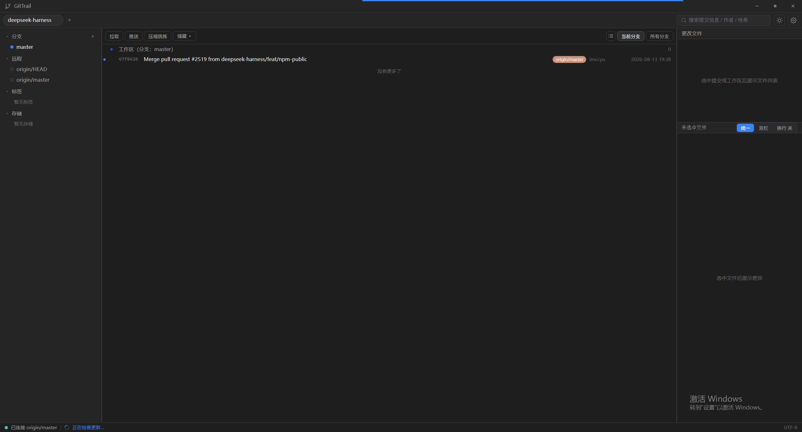
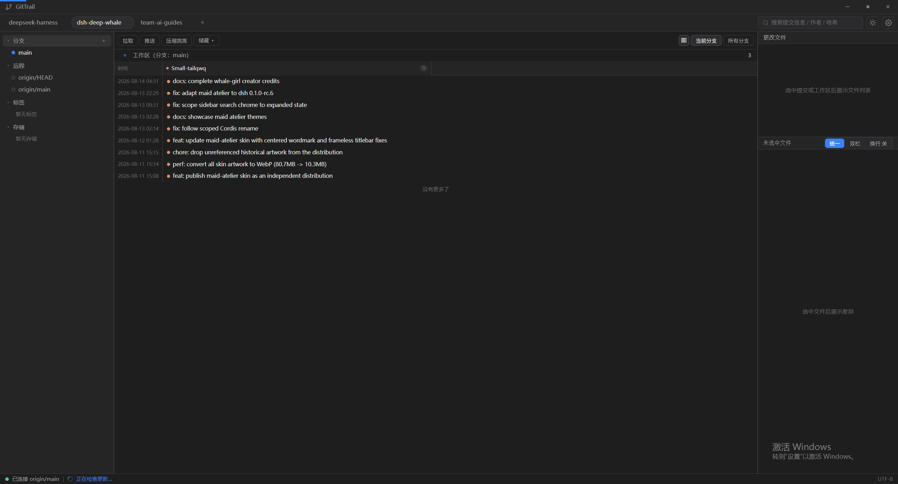
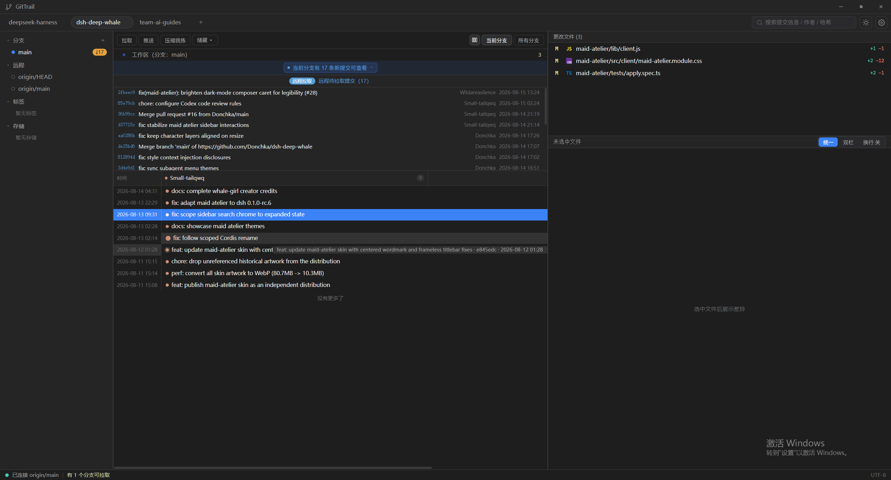
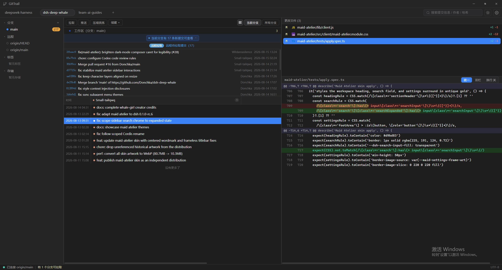

# GitTrail

> 扁平化 · 暗色优先 · 纯中文的桌面 Git 客户端

[](https://github.com/XiaMi-Long/git-client/releases)
[](LICENSE)
[](https://tauri.app)
[](https://vuejs.org)

GitTrail 是一款基于 **Tauri 2 + Vue 3** 的桌面 Git 客户端，聚焦本地高频 Git 操作，扁平化界面、暗色优先、纯中文体验。

[🌐 官方站点](https://XiaMi-Long.github.io/git-client/) · [⬇️ 下载](https://github.com/XiaMi-Long/git-client/releases) · [📖 使用文档](site/guide/getting-started.md)

## 特性

- **多仓库标签页** — 同时打开多个仓库，状态独立，重启自动恢复
- **分支管理** — 新建 / 检出 / 删除 / 重命名 / 合并 / 对比，切换分支自动暂存
- **提交泳道图 V2** — 行 = 提交、列 = 作者泳道，作者过滤、列宽 / 时间列可拖拽
- **未推送标识** — 本地领先上游的提交带「未推送」徽章（经典列表 / 泳道图一致）
- **暂存与提交** — 文件级 + hunk 级暂存，快捷提交（`Ctrl+Enter`）
- **diff 阅读** — 统一 / 双栏 / 词级高亮三种视图
- **cherry-pick / 压缩挑拣** — 提交右键快速挑选
- **冲突处理** — 冲突标记与解决引导，可中止恢复
- **储藏（stash）** — 暂存/未暂存/全部，命名储藏与查看
- **自定义标题栏** — 无边框窗口 + 自绘标题栏（拖拽 / 双击最大化 / 窗口控制）
- **自动更新** — GitHub Releases + 签名校验（框架已就绪）

## 截图






## 快速开始

前往 [GitHub Releases](https://github.com/XiaMi-Long/git-client/releases) 下载最新安装包（Windows x64），安装后点击顶栏「+」添加 Git 仓库即可使用。详细说明见[使用文档](site/guide/getting-started.md)。

## 从源码构建

### 环境要求

- Node.js 18+（推荐 22）
- Rust 工具链（[rustup](https://rustup.rs)）
- git（系统 PATH）
- Windows：WebView2、Visual Studio Build Tools（含"使用 C++ 的桌面开发"）

### 构建

```bash
npm install
npm run tauri build   # 产物在 src-tauri/target/release/bundle/
```

开发模式：`npm run tauri dev`（前端 HMR 热更新）。

## 官方站点

`site/` 目录为基于 [VitePress](https://vitepress.dev) 的官方站点（落地页 / 功能 / 使用文档 / 更新日志）：

```bash
cd site
npm install
npm run dev     # 本地预览
npm run build   # 构建静态产物（GitHub Actions 自动部署到 Pages）
```

## 技术栈

| 层 | 技术 |
|---|---|
| 桌面壳 | Tauri 2 |
| 前端 | Vue 3 · Pinia · TypeScript · Vite |
| 后端 | Rust · tokio · notify（文件监听）· ignore（.gitignore 过滤） |
| git 调用 | 系统 git（`--porcelain` / `--format` 机器友好输出解析） |

## 文档

- [设计语言](docs/design-language.md)
- [UI 规范](docs/ui-spec.md)
- [发布与自动更新指南](docs/RELEASE.md)
- [需求规范](openspec/)

## License

[MIT](LICENSE)
